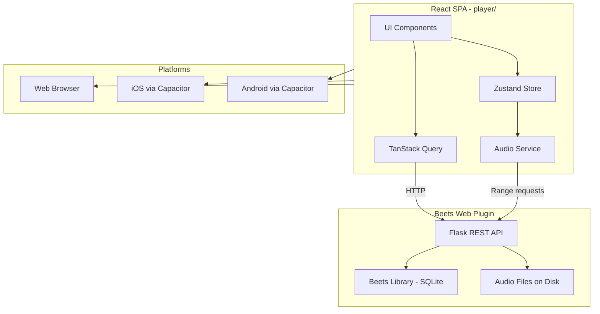

# Beets Media Player

## Architecture




## Why this stack

- **React + Vite + TypeScript** -- Fast dev loop, huge ecosystem, familiar to most developers
- **Capacitor** -- Wraps the web app into native iOS/Android shells. Unlike React Native, the UI code is identical across platforms (no "web vs native component" split). For a media player where performance-critical work is audio (not UI rendering), WebView-based is the right trade-off
- **Beets web plugin API** -- Already exists, full query syntax, exposes all metadata fields. Two small backend fixes (range requests for streaming, pagination) make it production-ready

## Backend Enhancements (small changes to existing code)

Two targeted changes in `[beetsplug/web/__init__.py](beetsplug/web/__init__.py)`:

**1. Enable range-request audio streaming** (one-line fix)

The current `item_file` endpoint at line 332 uses `flask.send_file()` without `conditional=True`, so browsers can't seek in audio. Fix:

```python
response = flask.send_file(
    item_path, as_attachment=True, download_name=safe_filename, conditional=True
)
```

**2. Add pagination** to item and album list endpoints

Add `?page=N&per_page=M` support (default 50) to `/item/`, `/item/query/`, `/album/`, `/album/query/`. Return `X-Total-Count` header for the frontend to know total results.

**3. Add lyrics endpoint** (if lyrics plugin is active)

`GET /item/<id>/lyrics` -- returns lyrics text from the item's `lyrics` field (populated by the beets lyrics plugin).

## Frontend -- `player/` directory

### Tech Stack


| Layer        | Choice                      | Why                                                               |
| ------------ | --------------------------- | ----------------------------------------------------------------- |
| Framework    | React 19 + TypeScript       | Standard, large ecosystem                                         |
| Bundler      | Vite                        | Fast HMR, great Capacitor integration                             |
| Styling      | Tailwind CSS v4             | Utility-first, responsive, dark mode                              |
| API state    | TanStack Query v5           | Caching, pagination, background refetch                           |
| Client state | Zustand                     | Lightweight, perfect for player state (queue, now-playing)        |
| Routing      | React Router v7             | Standard SPA routing                                              |
| Audio        | HTML5 Audio + Web Audio API | Audio element for playback, Web Audio for EQ                      |
| Mobile       | Capacitor v6                | Native shell for iOS/Android                                      |
| Offline      | Workbox (SW) + OPFS         | Service worker caching + Origin Private File System for downloads |


### Project Structure

```
player/
  src/
    api/           -- API client (typed, wraps fetch)
    components/
      ui/          -- Design system (Button, Card, Slider, etc.)
      player/      -- NowPlayingBar, FullScreenPlayer, Controls, ProgressBar
      library/     -- AlbumGrid, TrackList, ArtistList, AlbumDetail
      search/      -- SearchBar, SearchResults
      queue/       -- QueueList, QueueItem (drag-to-reorder)
    hooks/         -- useAudio, useMediaSession, useOffline, useInfiniteScroll
    pages/         -- Home, Artists, Albums, AlbumDetail, Search, Settings, NowPlaying
    stores/        -- playerStore (queue, current track, playback state, EQ)
    services/
      audio.ts     -- AudioContext + HTMLAudioElement wrapper, EQ chain
      offline.ts   -- Download manager, OPFS storage
      scrobble.ts  -- Last.fm scrobbling (direct API)
    types/         -- Item, Album, Artist, Playlist interfaces
  public/
  index.html
  capacitor.config.ts
  vite.config.ts
  tailwind.config.ts
  package.json
  tsconfig.json
```

### Screens

- **Home** -- Recently added albums, quick stats, continue listening
- **Artists** -- Alphabetical list, tap to see albums
- **Albums** -- Grid with cover art, infinite scroll
- **Album Detail** -- Track list, play all, album art hero
- **Search** -- Real-time search using beets query syntax
- **Now Playing** -- Full-screen album art, controls, progress, lyrics
- **Queue** -- Drag-to-reorder, clear, shuffle
- **Settings** -- Server URL, EQ presets, offline storage, Last.fm login, theme

### Audio Architecture


- `HTMLAudioElement` loads audio from `/item/<id>/file` with range requests (seeking works)
- Web Audio API `BiquadFilterNode` chain provides 5-band EQ
- `MediaSession` API provides lock screen / notification controls on all platforms
- Gapless playback via preloading next track's `AudioElement`

### Offline / Downloads

- **Service Worker** (Workbox) caches API responses and static assets
- **OPFS** (Origin Private File System) stores downloaded audio files
- Download manager in Zustand tracks progress, allows batch album downloads
- Offline library view shows only downloaded content

### Scrobbling

- Direct Last.fm API integration (client-side)
- OAuth flow for Last.fm login
- Scrobble after 50% or 4 minutes of playback (Last.fm rules)

### Development Workflow

- `cd player && npm run dev` -- Vite dev server with HMR, proxies `/item/`, `/album/`, etc. to beets
- `beet web` -- Runs beets API on port 8337
- `cd player && npm run build` -- Production build
- `cd player && npx cap sync && npx cap run ios` -- Build and run on iOS
- `cd player && npx cap sync && npx cap run android` -- Build and run on Android

## Implementation Order

Build incrementally, each phase produces a working player with progressively more features.