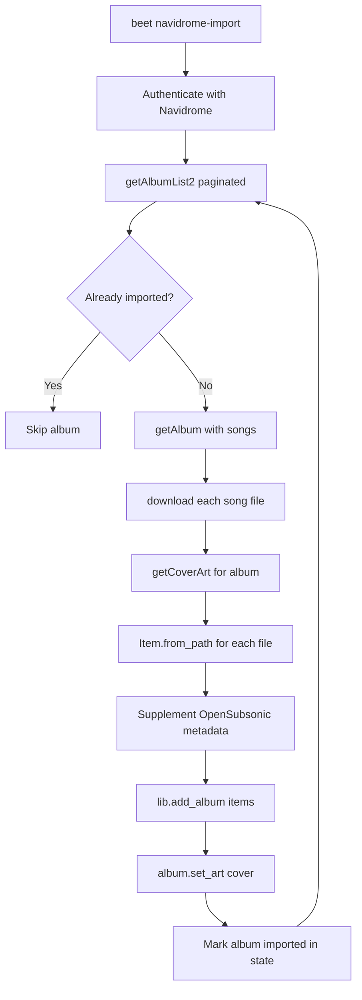

# Navidrome to Beets Import Plugin

## New file: `beetsplug/navidrome.py`

A single-file beets plugin that registers a `navidrome-import` subcommand.

## Data flow




## OpenSubsonic API integration

Authentication uses Navidrome's standard params on every request: `u`, `p` (or `t`+`s` for token auth), `v=1.16.1`, `c=beets`, `f=json`.

**Endpoints used:**

- `GET /rest/ping` -- verify connection
- `GET /rest/getAlbumList2?type=alphabeticalByName&size=500&offset=N` -- paginate all albums
- `GET /rest/getAlbum?id=X` -- get album details + song list
- `GET /rest/download?id=X` -- download original audio file (no transcoding)
- `GET /rest/getCoverArt?id=X` -- download album art

## Field mapping (OpenSubsonic Child -> beets Item)

File-embedded tags take priority (read via `Item.from_path()`). The following OpenSubsonic fields supplement what the file tags may be missing:

- `musicBrainzId` -> `mb_trackid`
- `album.musicBrainzId` (from AlbumID3) -> `mb_albumid` (on all items in album)
- `displayAlbumArtist` / `artist` (album-level) -> `albumartist`
- `genres[].name` -> `genre` (first) / `genres` (joined)
- `replayGain.trackGain` -> `rg_track_gain`, `.albumGain` -> `rg_album_gain`, `.trackPeak` -> `rg_track_peak`, `.albumPeak` -> `rg_album_peak`
- `playCount` -> flexible attr `play_count`
- `starred` -> flexible attr `starred`
- `bpm` -> `bpm`
- `comment` -> `comments`
- `discNumber` -> `disc`
- `track` -> `track`
- `year` -> `year`

## File organization

Downloaded files are placed in a staging directory first (configurable, defaults to `~/.cache/beets/navidrome-import/`), organized as:

```
staging/
  ArtistName/
    AlbumName/
      01 - TrackTitle.mp3
      cover.jpg
```

After `lib.add_album()`, beets' own path templates handle the final destination (copy/move based on beets config).

## Resume support

A JSON state file (`~/.cache/beets/navidrome-state.json`) tracks:

- Set of imported Navidrome album IDs
- Last pagination offset (for interrupted crawls)
- Timestamp of last run

On re-run, already-imported albums are skipped. A `--force` flag allows re-importing everything.

## Configuration (in beets `config.yaml`)

```yaml
navidrome:
    server: http://localhost:4533
    username: admin
    password: secret
    # OR token-based:
    # token: abc123
    # salt: xyz
    staging_dir: ~/.cache/beets/navidrome-import
    state_file: ~/.cache/beets/navidrome-state.json
    per_page: 500          # albums per API page (max 500)
    parallel_downloads: 3  # concurrent file downloads
```

## CLI interface

```
beet navidrome-import [options]

Options:
  --server URL        Navidrome server URL (overrides config)
  --username USER     Username (overrides config)
  --password PASS     Password (overrides config)
  --force             Re-import all, ignoring state file
  --dry-run           Show what would be imported without downloading
  --limit N           Only import first N albums (for testing)
```

## Key implementation details

- **Pagination**: Loop `getAlbumList2` with `offset += 500` until response returns fewer than `size` albums
- **Downloads**: Use `requests.Session` with connection pooling; `ThreadPoolExecutor` for parallel downloads (default 3 workers)
- **Large library safety**: Stream downloads to disk (don't buffer in memory); use `response.iter_content(chunk_size=8192)`
- **Error handling**: Per-album try/catch -- log failures and continue; failed albums stored in state for retry
- **Progress**: Log every album with count (`[142/1247] Importing: Artist - Album`), plus summary at end
- `**Item.from_path()`**: After downloading, create items from the actual files on disk so embedded tags are read correctly; then overlay any metadata the file is missing from the API response
- **Album art**: Download via `getCoverArt`, save as `cover.jpg` in staging, then `album.set_art(cover_path)` which copies it to the final location
- **Singleton tracks**: If an album has only 1 song and no real album name, import as singleton via `lib.add(item)` instead of `add_album`

## Existing code leveraged

- [beets/library/models.py](beets/library/models.py) -- `Item.from_path()` (line 579), `Album.set_art()` (line 539), field definitions
- [beets/library/library.py](beets/library/library.py) -- `Library.add()`, `Library.add_album()` (line 48)
- [beets/plugins.py](beets/plugins.py) -- `BeetsPlugin` base class
- [beets/ui/**init**.py](beets/ui/__init__.py) -- `Subcommand` for CLI registration
- [beetsplug/web/**init**.py](beetsplug/web/__init__.py) -- reference for plugin structure, config patterns

