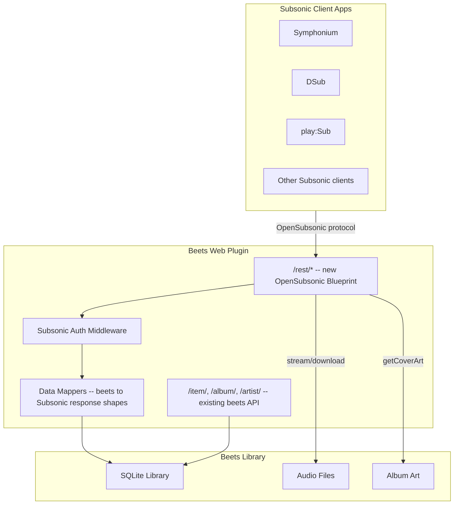

# OpenSubsonic Compatibility Layer for Beets Web Plugin

## Architecture



## New file: `beetsplug/web/subsonic.py`

A Flask Blueprint (`subsonic_bp`) registered at `/rest/` that implements the OpenSubsonic API endpoints. The existing beets web routes remain untouched.

## Small change: `beetsplug/web/__init__.py`

Register the new Blueprint on the existing `app`:

```python
from beetsplug.web.subsonic import subsonic_bp
app.register_blueprint(subsonic_bp, url_prefix="/rest")
```

Also pass the `subsonic` config section through to `app.config` (username, password).

## Subsonic Authentication

Every `/rest/*` request must include auth params (`u`, `p` or `t`+`s`, `v`, `c`). The Blueprint's `before_request` handler validates against the configured username/password.

- **Password mode**: `p` param matches config password (or hex-encoded with `enc:` prefix)
- **Token mode**: `md5(password + s)` == `t` param
- **Response**: Return Subsonic error code 40 ("Wrong username or password") on failure

Config in `config.yaml`:
```yaml
web:
    subsonic: true
    subsonic_user: admin
    subsonic_password: secret
```

## Response Format

All Subsonic responses are wrapped in a `subsonic-response` envelope:
```json
{
  "subsonic-response": {
    "status": "ok",
    "version": "1.16.1",
    "type": "beets",
    "serverVersion": "0.1.0",
    "openSubsonic": true,
    ...endpoint-specific data...
  }
}
```

A helper `_subsonic_response(data)` wraps any dict into this format. Errors use `{"status": "failed", "error": {"code": N, "message": "..."}}`.

Both `.view` suffix and bare paths are supported (e.g. `/rest/ping` and `/rest/ping.view`).

## Data Mappers (beets -> Subsonic)

Three core mapper functions convert beets objects to Subsonic response shapes:

**`_artist_to_id3(albumartist, albums)`** -> ArtistID3:
| Subsonic field | Beets source |
|---|---|
| `id` | Stable hash of `albumartist` name (artists have no ID in beets) |
| `name` | `albumartist` |
| `coverArt` | `"ar-" + id` |
| `albumCount` | Count of albums for this artist |

**`_album_to_id3(album)`** -> AlbumID3:
| Subsonic field | Beets source |
|---|---|
| `id` | `str(album.id)` |
| `name` / `album` / `title` | `album.album` |
| `artist` | `album.albumartist` |
| `artistId` | Hashed artist ID |
| `year` | `album.year` |
| `genre` | `album.genre` |
| `coverArt` | `"al-" + str(album.id)` |
| `songCount` | Count of items in album |
| `duration` | Sum of item lengths |
| `created` | ISO 8601 from `album.added` timestamp |

**`_item_to_child(item)`** -> Child (song):
| Subsonic field | Beets source |
|---|---|
| `id` | `str(item.id)` |
| `parent` | `str(item.album_id)` |
| `title` | `item.title` |
| `album` | `item.album` |
| `artist` | `item.artist` |
| `albumId` | `str(item.album_id)` |
| `artistId` | Hashed artist ID |
| `track` | `item.track` |
| `year` | `item.year` |
| `genre` | `item.genre` |
| `size` | File size via `os.path.getsize()` |
| `duration` | `int(item.length)` |
| `bitRate` | `item.bitrate // 1000` |
| `suffix` | `item.format.lower()` (mp3, flac, etc.) |
| `contentType` | Mapped from format (e.g. `audio/mpeg`, `audio/flac`) |
| `coverArt` | `str(item.id)` |
| `discNumber` | `item.disc` |
| `path` | `artist/album/filename` relative path |
| `isDir` | `false` |
| `isVideo` | `false` |
| `type` | `"music"` |
| `created` | ISO 8601 from `item.added` |
| `musicBrainzId` | `item.mb_trackid` (if present) |

## Endpoints to Implement

### Priority 1 -- Required for any client to connect

| Endpoint | Method | Summary |
|---|---|---|
| `ping` | GET | Returns empty success response |
| `getLicense` | GET | Returns `{"valid": true}` |
| `getArtists` | GET | All artists indexed alphabetically |
| `getArtist` | GET | Albums for a given artist |
| `getAlbum` | GET | Album detail + song list |
| `getSong` | GET | Single song detail |
| `getAlbumList2` | GET | Paginated album lists (alphabetical, newest, random, byYear, byGenre) |
| `search3` | GET | Search artists, albums, songs with pagination |
| `stream` | GET | Stream audio file (with range requests) |
| `download` | GET | Download original audio file |
| `getCoverArt` | GET | Serve album art (parse `al-N` or `ar-N` or plain ID) |
| `getMusicFolders` | GET | Return a single "beets" music folder |
| `getGenres` | GET | Return all unique genres |

### Priority 2 -- Needed for full client functionality

| Endpoint | Method | Summary |
|---|---|---|
| `getRandomSongs` | GET | Return N random songs |
| `star` / `unstar` | GET | Star/unstar items (stored as flexible attrs) |
| `getStarred2` | GET | Return all starred items |
| `scrobble` | GET | No-op or log (beets has no play history) |
| `getUser` | GET | Return hardcoded user info |
| `getPlaylists` | GET | Return empty list (or future support) |
| `getOpenSubsonicExtensions` | GET | Declare supported extensions |
| `getSongsByGenre` | GET | Songs filtered by genre |

### Not implemented (return empty/stub)

Playlists, Podcast, Chat, Jukebox, Sharing, Internet Radio, User Management, Bookmarks -- return valid but empty responses to avoid client errors.

## Implementation Details

### Artist IDs

Beets has no artist entity -- artists are derived from `albumartist` on albums. The Subsonic API requires artist IDs. Solution: generate a stable integer ID by hashing the albumartist name: `zlib.crc32(name.encode()) & 0x7FFFFFFF`. This is deterministic and consistent across requests.

### Album list types (getAlbumList2)

Map the `type` parameter to beets queries:
- `alphabeticalByName` -> `ORDER BY album`
- `alphabeticalByArtist` -> `ORDER BY albumartist, album`
- `newest` -> `ORDER BY added DESC`
- `random` -> SQL `ORDER BY RANDOM()`
- `byYear` -> Filter by `fromYear`/`toYear`, order by year
- `byGenre` -> Filter by `genre:X`
- `starred` -> Filter items with `starred` flexible attr

### search3

Use beets' existing query system. The Subsonic `query` param becomes a beets query string. Search items where `title`, `artist`, or `album` contains the query, and albums where `album` or `albumartist` contains it.

### stream and download

Both serve the audio file at `item.path`:
- `stream`: `flask.send_file(path, conditional=True)` -- supports range requests
- `download`: `flask.send_file(path, as_attachment=True, conditional=True)`

### getCoverArt

Parse the `id` parameter:
- `al-N`: Album art from `album.artpath`
- `ar-N`: No direct artist art in beets -- return 404 or first album's art
- Numeric N: Item's album art (look up item, get album, serve artpath)

### Format suffix (.view)

Subsonic clients append `.view` to endpoints. Register routes both with and without: `/rest/ping` and `/rest/ping.view`.

## Config additions to `beetsplug/web/__init__.py`

```python
self.config.add({
    ...existing...,
    "subsonic": False,            # Enable Subsonic API
    "subsonic_user": "beets",     # Subsonic username
    "subsonic_password": "beets", # Subsonic password
})
```

Only register the Blueprint when `subsonic: true`.
